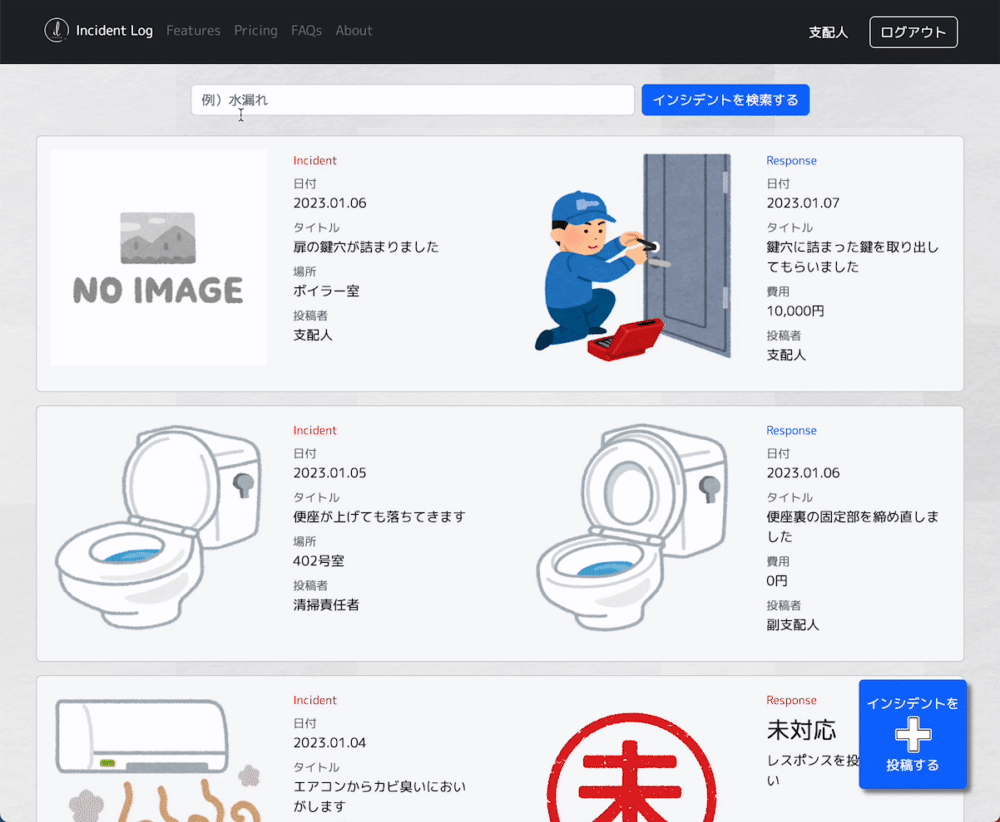

# アプリケーション名

Incident Log（インシデントログ）

<br>

# アプリケーション概要

ホテル内の設備や備品の故障・破損などの不備（インシデント）を投稿することができる。

またその対処内容（レスポンス）をセットで記録することができる。

検索機能で過去のインシデントとレスポンスを参照することで、類似のインシデント発生の際に、迅速で適切なアプローチを選択することができる。

また対処ノウハウを蓄積・共有することで、「その件は〇〇さんしか対応したことがないからわからない」というような業務の属人化を解消することができる。

<br>

# URL

https://incident-log.onrender.com/

<br>

# テスト用アカウント

- Basic認証ID：admin

- Basic認証パスワード：2222

- ユーザー名：支配人

- パスワード：111111

<br>

# 利用方法

1. ヘッダーの新規登録ボタンからユーザー新規登録をおこなう

2. 一覧ページのインシデント投稿ボタンから日付、タイトル、内容、場所を入力し、任意で画像を添付し投稿する

3. インシデント解消後、インシデント詳細画面のレスポンス投稿ボタンから日付、タイトル、内容、費用を入力し、任意で画像を添付し投稿する

4. 一覧ページの検索フォームから過去のインシデントおよびレスポンスを検索できる

5. インシデント詳細ページのコメント投稿フォームからコメントを投稿できる

<br>

# アプリケーションを作成した背景

ホテルでは日々設備故障や備品破損など様々なインシデントが発生する。

これまでは担当制というわけではなかったが、たいていの場合ある特定の人物が対応していた。

しかし24時間営業のホテルにおいて、勤務はシフト制のため、その人物がいつも対応できるわけではなく、インシデント解消までの間、しばらく客室を売り止めにするということも少なくなかった。

そしてそのような状態では、

- 販売機会ロスの発生
- 緊急を要するインシデントに対応できない（滞在中の客室内でのインシデントなど）

などの課題があった。

そのため、インシデントの内容とその対処法のノウハウを蓄積・共有することで、類似のインシデント発生の際は、

- 過去のインシデントを参照し、迅速で適切な対処が可能になる
- 特定の人物のみしか対応できないという「属人化」の解消

を目的として作成した。

<br>

# 洗い出した要件

https://docs.google.com/spreadsheets/d/1rabXuI0YQNptYdlvjKqLm-W6KLKZiC7SpHgJurc59lc/edit?usp=sharing

<br>

# 実装した機能についての説明

## 一覧ページ（トップページ） → インシデント投稿ページ


<br>

## 一覧ページ（トップページ） → 検索結果ページ → インシデント詳細ページ



<br>

# 実装予定の機能

- 非同期通信検索機能（即時絞り込み）
- インシデント項目「場所」による検索

<br>

# データベース設計

[](https://gyazo.com/cb3c630cccac785c8f026d20a0fb4101)

<br>

# テーブル設計

## users テーブル

| Column             | Type    | Options                   |
| ------------------ | ------- | ------------------------- |
| name               | string  | null: false               |
| email              | string  | null: false, unique: true |
| encrypted_password | string  | null: false               |

### Association

- has_many :incidents
- has_many :responses
- has_many :comments

<br>

## incidents テーブル

| Column   | Type       | Options                        |
| -------- | ---------- | ------------------------------ |
| date     | string     | null: false                    |
| title    | string     | null: false                    |
| content  | text       | null: false                    |
| place_id | integer    | null: false                    |
| user     | references | null: false, foreign_key: true |

### Association

- belongs_to :user
- has_one :response
- has_many :comments

<br>

## responses テーブル

| Column   | Type       | Options                        |
| -------- | ---------- | ------------------------------ |
| date     | string     | null: false                    |
| title    | string     | null: false                    |
| content  | text       | null: false                    |
| cost     | string     | null: false                    |
| user     | references | null: false, foreign_key: true |
| incident | references | null: false, foreign_key: true |

### Association

- belongs_to :user
- belongs_to :incident

<br>

## comments テーブル

| Column   | Type       | Options                        |
| -------- | ---------- | ------------------------------ |
| content  | text       | null: false                    |
| user     | references | null: false, foreign_key: true |
| incident | references | null: false, foreign_key: true |

### Association

- belongs_to :user
- belongs_to :incident

<br>

# 画面遷移図

[](https://gyazo.com/cda7edc73d580768bdffa3d35654e3f0)

<br>

# 開発環境

Ruby / Ruby on Rails / HTML / CSS / JavaScript / Bootstrap5 / MySQL / Github / Render / Visual Studio Code

<br>

# ローカルでの動作方法

```
% git clone https://github.com/kkoemna/incident-log
% cd incident-log
% bundle install
% yarn install
```

<br>

# 工夫したポイント

- 初めて使う人も使い方に迷わないようフォームのplaceholderに例文を入れた
- 細かい説明がなくても使い方に迷わないようなるべく日本語表記を使用した
- 一覧ページ以外の各ページに「前のページに戻るボタン」を作成した